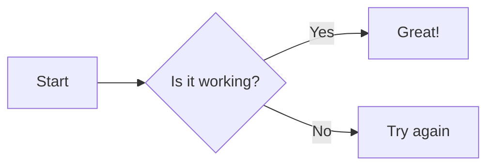

# 🧜‍♂️ Mermaid Server

A professional-grade, self-hosted web environment for creating, managing, and exporting Mermaid diagrams. Built with **Next.js**, **Tailwind CSS**, and **SQLite**.

## ✨ Features

- **Live Preview:** Instant, real-time rendering of Mermaid diagrams as you type.
- **Multi-Project Management:** Create, rename, and organize multiple diagram projects.
- **Image Gallery:** Upload your own logos or assets (up to 100MB) directly into the database.
- **Smart Image Integration:** One-click "Copy Tag" to insert uploaded images into your diagrams using standard Mermaid syntax.
- **Professional Exports:** Download your visualizations in **SVG**, **PNG**, or **JPEG** formats.
- **Robust Error Handling:** Real-time syntax validation that clears automatically when errors are fixed.
- **Persistent Storage:** Your work is saved automatically to a local database.

## 🚀 Getting Started

### Prerequisites
- Node.js 18.x or later
- npm or yarn

### Installation
1. Clone the repository:
   ```bash
   git clone <your-repo-url>
   cd mermaid
   ```
2. Install dependencies:
   ```bash
   npm install
   ```
3. Initialize the database:
   ```bash
   npx drizzle-kit push
   ```
4. Start the development server:
   ```bash
   npm run dev
   ```
5. Open [http://localhost:3000](http://localhost:3000) in your browser.

## 📖 How to Use

### 1. Creating Diagrams
Use the **Projects** tab in the sidebar to create a new diagram. Type standard Mermaid DSL in the editor. For example:


### 2. Adding Images & Logos
1. Switch to the **Images** tab in the sidebar.
2. Upload a file (PNG, JPG, SVG supported).
3. Once uploaded, click the **Copy icon** next to the image.
4. Paste the copied tag (e.g., ``) directly into a node's brackets in the editor:
   ```mermaid
   flowchart TD
       User[<br/>Admin User]
   ```

### 3. Exporting
Use the buttons in the top header to download your work. 
- **SVG:** Best for high-quality documents and scaling.
- **PNG/JPEG:** Best for sharing and presentations. (Note: External images may require CORS permission; uploaded images work perfectly).

## 💾 Where is my data?

This project uses a **local SQLite database** for maximum simplicity and zero-config deployment.

- **File Path:** All your projects, diagram code, and uploaded images are stored in a single file named `mermaid.db` in the root of the project directory.
- **Technology:** We use **Drizzle ORM** for type-safe database queries and **better-sqlite3** for the underlying engine.
- **Backups:** To back up your entire server, simply copy the `mermaid.db` file. No separate database server (like Postgres or MySQL) is required.

---

*Built with ❤️ for visual thinkers.*
